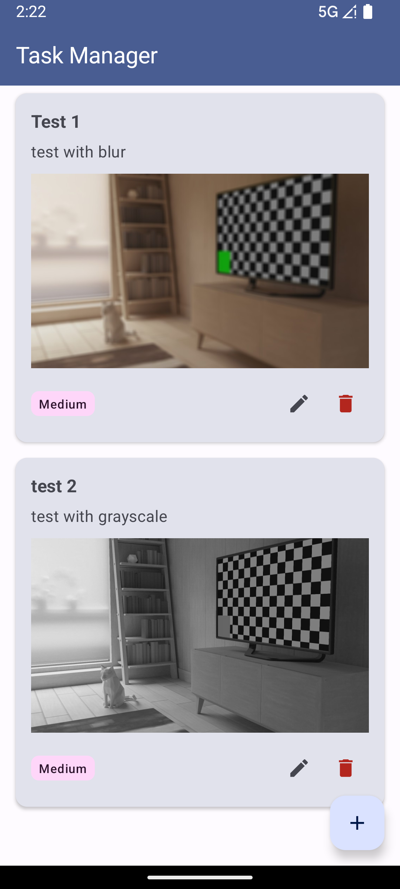

# Swift SDK for Android: Materials

This repo contains all the downloadable materials and projects associated with the **Swift SDK for Android** module in:

### [Course](https://www.kodeco.com/library)

- This course is part of [Program](https://www.kodeco.com), which you can take as either on-demand or live bootcamp from [Kodeco](https://www.kodeco.com).

## About This Module

Learn how to integrate Swift code into your Android applications using **Swift SDK for Android**! This 3-lesson module teaches you how to build a hybrid Task Manager app that leverages Swift for business logic while maintaining a native Kotlin UI with Jetpack Compose.

### What You'll Build

By the end of this module, you'll have created a fully functional **Task Manager** app that demonstrates real-world Swift-Android integration patterns.

---

## 🚀 Getting Started (For Reviewers)

### Prerequisites

Before building these projects, ensure you have:

- **macOS 13.0+** (Ventura or later) or **Ubuntu 20.04+** / **Debian 12+** 
- **Android Studio** (Iguana 2023.2.1 or later)
- **Android SDK** with API Level 34
- **Android NDK 27**
- **Java 17** (bundled with Android Studio)
- **Git** for cloning the repository

### Step 1: Install Swiftly (Swift Toolchain Manager)

Swiftly is the official Swift toolchain manager that makes it easy to install and manage Swift versions.

#### On macOS:

```bash
curl -L https://swift-server.github.io/swiftly/swiftly-install.sh | bash
```

#### On Linux:

```bash
curl -L https://swift-server.github.io/swiftly/swiftly-install.sh | bash
```

After installation, restart your terminal or run:

```bash
source ~/.local/share/swiftly/env.sh
```

Verify installation:

```bash
swiftly --version
```

### Step 2: Install Swift 6.3 Development Snapshot

Install the Swift 6.3 development snapshot (required for Swift SDK for Android):

```bash
swiftly install 6.3-snapshot
swiftly use 6.3-snapshot
```

Verify Swift installation:

```bash
swift --version
# Should show: Swift version 6.3-dev
```

### Step 3: Install Swift SDK for Android

Install the Swift SDK for Android:

```bash
swift sdk install https://download.swift.org/swift-6.3-branch/android-sdk/swift-6.3-DEVELOPMENT-SNAPSHOT-2026-01-16-a/swift-6.3-DEVELOPMENT-SNAPSHOT-2026-01-16-a_android.artifactbundle.tar.gz --checksum 080da5553cdd12d286f715d86527089e7c924093733f8f4e1195f2bd2137d45c
```

**Note:** Check [swift.org/install](https://www.swift.org/install/) for the latest snapshot URL and checksum if this is outdated.

Verify SDK installation:

```bash
swift sdk list
# Should show: swift-6.3-DEVELOPMENT-SNAPSHOT-2026-01-16-a_android (installed)
```

### Step 4: Set Up Android Studio

1. **Open Android Studio** and install:
   - Android SDK Platform 34
   - Android NDK 27.2.12479018 (via SDK Manager → SDK Tools → NDK)
   - Android SDK Build-Tools 34.0.0

2. **Configure NDK Path:**
   - Open **Preferences** → **Appearance & Behavior** → **System Settings** → **Android SDK**
   - Go to **SDK Tools** tab
   - Check **NDK (Side by side)**
   - Note the NDK path (typically `~/Library/Android/sdk/ndk/27.2.12479018`)

3. **Set Environment Variables** (add to `~/.zshrc` or `~/.bash_profile`):

```bash
export ANDROID_HOME=$HOME/Library/Android/sdk
export ANDROID_NDK_HOME=$ANDROID_HOME/ndk/27.2.12479018
export PATH=$PATH:$ANDROID_HOME/platform-tools
export PATH=$PATH:$ANDROID_HOME/cmdline-tools/latest/bin
```

Then reload your shell:

```bash
source ~/.zshrc  # or source ~/.bash_profile
```

### Step 5: Link NDK to Swift SDK

**Critical:** After installing both the Swift SDK and Android NDK, run the setup script to link them:

```bash
cd ~/Library/org.swift.swiftpm || cd ~/.swiftpm
./swift-sdks/swift-6.3-DEVELOPMENT-SNAPSHOT-2026-01-16-a_android.artifactbundle/swift-android/scripts/setup-android-sdk.sh
```

You should see this success message:
```
setup-android-sdk.sh: success: ndk-sysroot linked to Android NDK at android-ndk-r27d/toolchains/llvm/prebuilt
```

**Why this is needed:** The Swift SDK expects the NDK at a specific symlink path. Without this step, builds will fail with "ndk-sysroot not found" or "semaphore.h not found" errors.

### Step 6: Clone and Build the Projects

1. **Clone the repository:**

```bash
git clone https://github.com/kodecocodes/m3-swfa-materials.git
cd m3-swfa-materials
```

2. **Navigate to a project** (e.g., Lesson 1 Final):

```bash
cd 01-swift-java-interop/Final
```

3. **Build Swift code:**

```bash
./gradlew buildSwift
```

This task:
- Compiles Swift for 3 architectures (arm64-v8a, armeabi-v7a, x86_64)
- Generates libTaskManagerKit.so for each architecture
- Copies all libraries to `app/src/main/jniLibs/`
- Includes Swift runtime libraries (~28 files per architecture)

4. **Build the Android app:**

```bash
./gradlew assembleDebug
```

Or open the project in Android Studio and click **Run** ▶️

### Troubleshooting

**Issue:** `Swift SDK not found`
- **Solution:** Run `swift sdk list` to verify SDKs are installed
- Ensure you're using Swift 6.3 snapshot: `swiftly use 6.3-snapshot`

**Issue:** `NDK not found`
- **Solution:** Set `ANDROID_NDK_HOME` environment variable
- Verify NDK is installed: `ls $ANDROID_HOME/ndk/`

**Issue:** `buildSwift task fails`
- **Solution:** Check Swift installation: `swift --version`
- Ensure all 3 Android SDKs are installed: `swift sdk list`

**Issue:** Build succeeds but app crashes on launch
- **Solution:** Verify correct libraries are in `jniLibs/` folders
- Check that Swift runtime libraries were copied (should be ~29 files per architecture)

### Testing on Device/Emulator

1. **For Emulator:** Use x86_64 image (API 28+)
2. **For Physical Device:** Use ARM64 device (most modern Android phones)
3. **Grant Permissions:** Camera permission required for Lessons 2 & 3

---

## 📦 Project Structure

```
m3-swfa-materials/
├── 01-swift-java-interop/
│   ├── Starter/          # Basic Android UI, no Swift integration
│   └── Final/            # Complete with Swift validation
├── 02-platform-integration/
│   ├── Starter/          # Copy of Lesson 1 Final (clean)
│   └── Final/            # + Camera + Swift image processing
├── 03-data-persistence/
│   ├── Starter/          # Copy of Lesson 2 Final (clean)
│   └── Final/            # + Persistence + CRUD operations
├── images/               # Screenshots and assets
├── scratch/              # Development documentation
└── README.md            # This file
```

Each project contains:
- **TaskManagerKit/** - Swift package with business logic
- **app/** - Android app with Kotlin/Compose UI
- **build.gradle** - Custom buildSwift task configuration
- **README.md** - Project-specific documentation

---

## Final App Demo

After completing all three lessons, your Task Manager app will feature:



**Lesson 1: Swift-Java Interoperability**
- Swift-based validation for task titles (3-50 characters) and descriptions (10-200 characters)
- Bidirectional JNI communication between Kotlin and Swift
- Type-safe data marshaling across language boundaries

**Lesson 2: Platform Integration**
- Camera capture using CameraX
- Real-time image processing with Swift filters:
  - Grayscale conversion
  - Blur effects
  - Brightness adjustments
- Photo attachment to tasks

**Lesson 3: Data Persistence & Testing**
- JSON-based task persistence (tasks survive app restarts)
- Photo persistence
- Full CRUD operations (Create, Read, Update, Delete)
- Material Design 3 UI with priority badges

### App Highlights:

- **Hybrid Architecture**: Swift handles business logic and validation, Kotlin handles UI
- **Production Patterns**: Repository pattern, singleton managers, proper error handling
- **Modern UI**: Material Design 3 with Jetpack Compose
- **Real-World Integration**: Demonstrates practical Swift SDK for Android usage

--- 

Each edition has its own branch, named `versions/[VERSION]`. The default branch for this repo is for the most recent edition.

## Release History

| Branch                                                                                  | Version | Release Date |
| --------------------------------------------------------------------------------------- |:-------:|:------------:|
| [versions/1.0](https://github.com/kodecocodes/m3-swfa-materials/tree/versions/1.0) | 1.0     | YYYY-MM-DD   |
